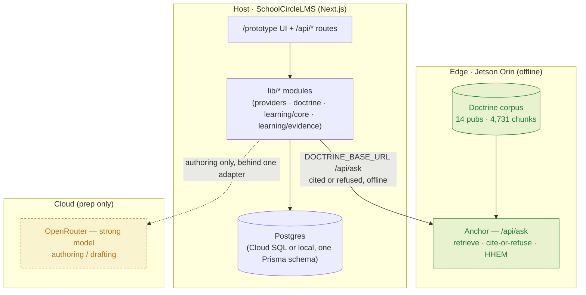

# 02 · Architecture

How SchoolCircleLMS is wired. The one idea to hold onto: **every feature is the same spine wearing a different face.** Build the spine once; each surface is a different input→output binding on it.

See also: [01 · Design System](01-design-system.md) · [03 · Data Model](03-data-model.md) · [04 · Grounding & Anchor](04-grounding-and-anchor.md) · [05 · Arsenal & Contracts](05-arsenal-contracts.md) · [06 · Learner Loop](06-learner-loop.md) · [07 · Instructor Loop](07-instructor-loop.md).

---

## The spine

Everything the platform generates or answers runs the same four steps:

```
Ground  →  Cite-or-refuse  →  Verify (HHEM)  →  Human review
```

1. **Ground** — retrieve the exact passages for the task from the indexed corpus (Anchor: BM25 + dense + rerank). The model answers *from retrieved paragraphs*, never from memory.
2. **Cite-or-refuse** — answer only from those passages, each factual sentence carrying a paragraph-level citation; abstain when retrieval doesn't support one. Abstention is a correct answer, not an error (see [04](04-grounding-and-anchor.md)).
3. **Verify** — an on-device HHEM entailment check scores faithfulness before anything is shown; the premise gate catches a smuggled false specific that retrieval scores high. Low score → don't show.
4. **Human review** — an instructor approves, edits, or rejects. Nothing `PENDING` reaches a learner (`ItemStatus` in [03](03-data-model.md)).

Because the guarantee lives in the spine, it holds identically for a generated course, a tutor answer, a rubric, and a quiz. That is why "grounded" is a property of the platform, not a promise on one screen.

---

## Topology — edge / host / cloud



- **Edge (Anchor)** grounds every answer and runs fully offline on a ~$500 Jetson Orin Nano — proven with the network cable out. **Grounding** never needs the network; the app's **sign-in** still does (Firebase Authentication), so "Anchor is offline" is the claim, not "SchoolCircle is offline". An offline auth path is a separate, unfinished lane. See [04](04-grounding-and-anchor.md).
- **Host (SchoolCircleLMS)** is one Next.js app: the `/prototype` UI, `/api/*` route handlers, `lib/*` modules, and a Prisma DB. It orchestrates; Anchor grounds.
- **Cloud (OpenRouter)** is reached **only** for authoring (drafting a course from a POI) and only behind the adapter. If it is blocked, late, or swapped, one file changes — delivery is unaffected.

---

## The three flows (the app's backbone)

Every screen belongs to one of three flows. The screen-level loops are specified in [06 · Learner Loop](06-learner-loop.md) and [07 · Instructor Loop](07-instructor-loop.md); the exact call chains (route → `lib` fn → repo → Anchor → Postgres table) are the **sequence diagrams in the Range Card** — treat those as the wiring source of truth.

| Flow | Runs | What moves |
|---|---|---|
| **① Author** | prep (cloud allowed) | Doctrine PDF/POI → Quarry → Anchor (index) → Coursewright + Rubricon (cited course + BARS) → instructor review → Cartridge (SCORM) |
| **② Deliver** | edge, offline | learner question/answer → Sourcerer / Whetstone → Understudy (fidelity) → Anchor (cite-or-refuse · HHEM) → cited answer / coached / refused |
| **③ Improve** | the loop | attempts · turns · critiques → Sextant (gain · gaps · evidence) → Insight (class) · Hotwash (course AAR) → Cadence (next study plan) → feeds the next course |

---

## The adapter pattern (why one file changes, not the app)

All model access goes through a single capability registry — `lib/providers.js`. Feature code never imports a vendor SDK directly.

- **`text`** — the authoring model (OpenRouter/Gemini by default). Marked **critical**: if absent, `/api/capabilities` reports it in the blocking set.
- **`grounding`** — the Anchor doctrine adapter (`lib/doctrine.js`). Marked **non-critical**: with `DOCTRINE_BASE_URL` unset, nothing breaks; `/api/capabilities` reports grounding unavailable with a reason and the app still runs.

Every model call is env-configurable. The real variable names are the ones `lib/providers.js` reads: `MODEL_BASE_URL`, `MODEL_ID`, `MODEL_API_KEY` (falling back to `OPENAI_API_KEY` / `OPENROUTER_API_KEY` for those endpoints) for `text`, and `DOCTRINE_BASE_URL` for `grounding`. There is **no** per-capability `<CAP>_ENDPOINT` / `<CAP>_MODEL` pattern — it was designed and never implemented (see the note at `lib/arsenal-core.js:2464`); one shared `text` provider serves every helper. **A local dev path must exist regardless of what compute the event provides** — that is a build-week risk, not a stack choice. The gameday compute ("supercomputer allocation") plugs in behind the same `text` adapter with one env change.

---

## Offline & resilience

- **One schema, Postgres both ends.** The same Prisma schema runs in the cloud (Cloud SQL) and on the hardware (local Postgres) — keep `provider = "postgresql"` and change `DATABASE_URL`. A SQLite **edge** target is a real goal, but it is **not** a connection-string-only swap: the provider change pulls in type and migration work the schema has not had yet (`prisma/schema.prisma:4`, `docs/CLOUD_POSTGRES.md:251`). Don't promise it as one line.
- **$0 per Anchor call.** With the corpus indexed on the board, grounded answers cost nothing and keep coming with the cable out. The app's sign-in is the part that still needs the internet.
- **Degrade, don't crash — by refusing, not by substituting.** There is **no** Postgres full-text-search fallback in this codebase. If Anchor is unreachable the tutor reports the grounding engine unavailable and records the turn as failed; it never answers from a weaker source. That is deliberate: a silent second answerer is how invented doctrine gets back in. Anchor's own HHEM verifier does fail open (a verifier outage degrades to answering, not to crashing).

---

## Next.js structure

This is the tree as it actually stands. `/learn` and `/teach` were **removed** and now 404 — `tests/legacy-route-removal.mjs` fails the build if either comes back.

```
app/
  prototype/                 the product (instructor + student surfaces)
    [[...path]]/             one catch-all; routes.js is the URL grammar
    Prototype.js, InstructorShell.js, StudentShell.js, Mastery.js, Library.js, ...
  login/, plan/, page.js     sign-in, planner, landing
  api/
    learning/courses/draft/[stream/]  POST → course generation (SSE on /stream)
    learning/tutor/          POST → tutor() cite-or-refuse (Sourcerer + Anchor)
    doctrine/                POST → the same tutor(); legacy entry point
    learning/rubrics/generate/        POST → Rubricon
    learning/mastery/sessions/[id]/turn/  POST → Whetstone
    learning/courses/[id]/items/[itemId]/review/  POST → approve/edit/reject
    learning/export/         GET  → Cartridge (SCORM zip)
    learning/analytics/, learning/aar/, plan/, ingest/, generate/
    capabilities/, auth/user/, feedback/
lib/
  providers.js               capability registry (text critical, grounding non-critical)
  doctrine.js                Anchor adapter (DOCTRINE_BASE_URL → /api/ask, /api/verify)
  learning/core.js           the loop: tutor, draftCourseRecord, generateRubricRecord,
                             startMastery, masteryTurn, approveCourse
  learning/verify-support.js on-approval entailment scoring → Item.support
  learning/evidence.js       SCORM export + competency evidence
  db.js, poi-parser.js, model.js, auth.js, student-grounding.js
prisma/schema.prisma         one schema, provider = "postgresql"
```

Route handlers are the seam between UI and the platoon; `lib/*` wrappers are where each open-source repo is consumed ([05](05-arsenal-contracts.md)). Keep vendor/model calls inside `lib/*` — the routes and UI stay provider-agnostic.
