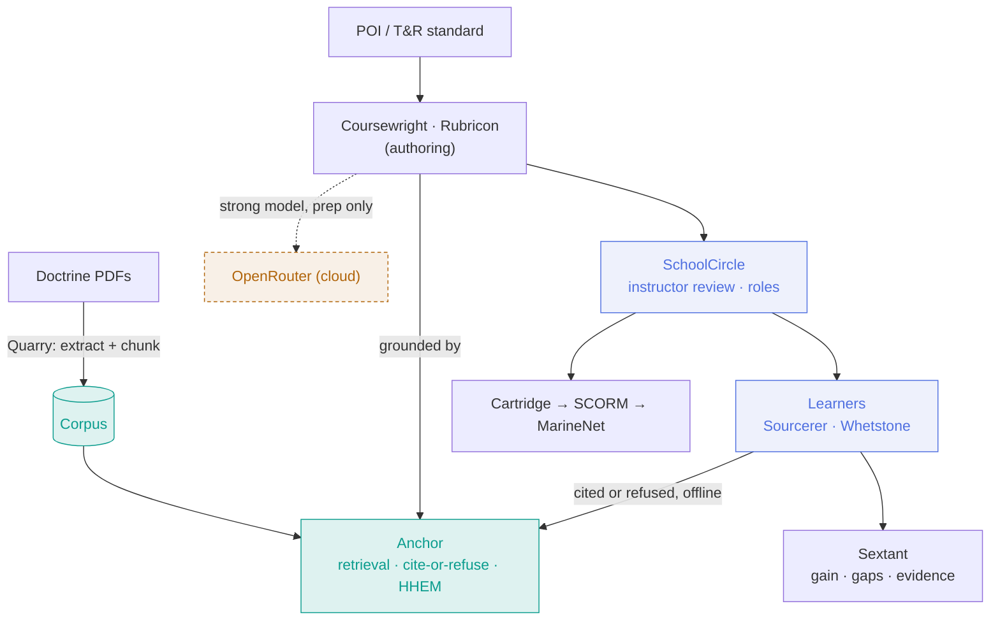
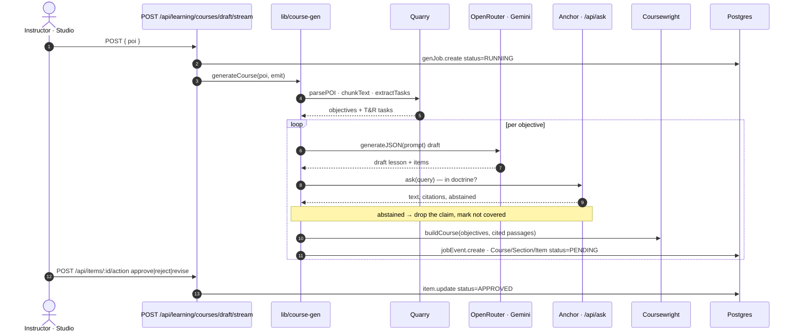
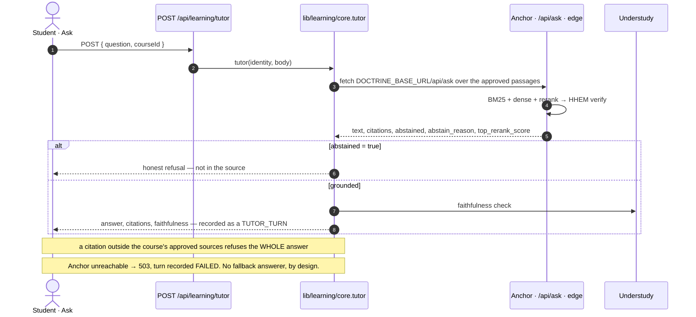
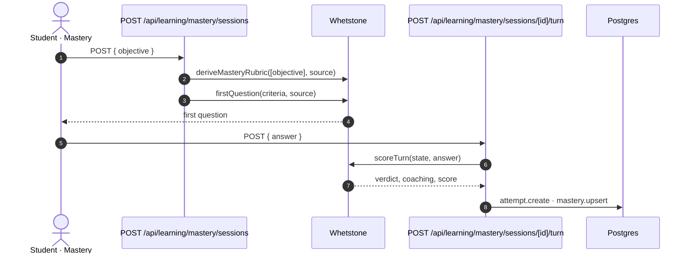
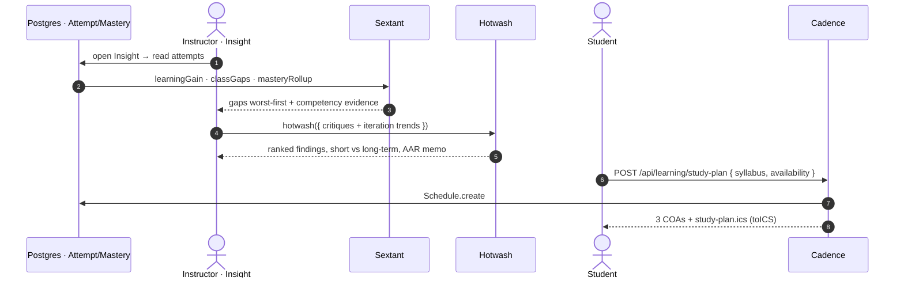

# Operation Cold Bore — Range Card

> The gameday operator's brief — pitch, live-demo runbook, contingencies, architecture, the platoon wired piece-by-piece into the app, metrics, and submission package.

**Tags:** Gameday Brief · Companion to Operation Cold Bore · Unclassified · Releasable

## Operation Cold Bore — Range Card

The shooter's reference for making the shot — the pitch, the live-demo runbook, the contingencies, the architecture, the platoon wired piece-by-piece into the app, the numbers, and the submission package. One card, so the demo runs cold and the story lands.

## PITCH — Ninety seconds, said out loud

**The problem.** AI can generate training fast — but it hallucinates, and a wrong "fact" in doctrine is a training failure that follows a Marine to the fight. And the schoolhouse or the field often has no reliable network.

**What we built.** One grounded platform — SchoolCircle on the surface, Anchor grounding it on a Jetson Orin — that generates cited courses, tutors from the source, and assesses Marines to mastery on real doctrine, with **the answering engine running on the board, not in a cloud**.

**Why it wins.** It isn't another chatbot. It's **grounded** (every claim cites the manual, or it refuses), **verified** (HHEM on-device, and grounding / rubrics / fidelity are all proven not asserted), **offline at the edge** (pull the network cable and the $500 board keeps serving cited answers and keeps refusing what it can't support — measured, not asserted), and **human-led** (nothing unreviewed reaches a student). And it's **open** — standalone Apache-2.0 products any command can adopt.

**Say the boundary before a judge finds it.** What is offline-proven is **Anchor**, the grounding engine on the Orin. **SchoolCircle itself is not offline-capable yet** — as deployed today (measured 17 Sep 2026) its sign-in calls Firebase Authentication over the internet, so with the cable out the board keeps answering but the app cannot log a new user in. That is an auth-configuration property of the deployment, not of the board. Never claim "the whole product runs offline"; claim what we measured, which is impressive on its own.

**The ask.** Adopt at the schoolhouse, edge-first, open-source. The pieces are already public, tested, and green.

## NUMBERS — By the numbers

**Every row here says how it was arrived at, and the right-hand column is the
receipt.** Rows marked *measured* were taken off this stack on 17 Sep 2026. Rows marked
*inferred* or *estimate* are reasoning from the architecture, not a stopwatch reading —
they are labelled as such and must be said that way out loud. A number nobody can
reproduce in front of a judge is worse than no number, so anything that could not be
measured from the gameday machine has been pulled out and listed under the table instead
of being carried forward. **The test count is a snapshot of the 17 Sep run — re-run the
suite before you quote it to a judge.**

| Metric | What it is | How it was checked |
| --- | --- | --- |
| **4.9–7.6s** | a grounded, cited answer on the edge | four questions to `POST /api/ask` on the Orin; every one answered with citations (4.94 / 5.42 / 5.85 / 7.62s) |
| **5 / 5** | out-of-doctrine questions correctly refused | five questions outside the corpus; all abstained with `low_retrieval_score`, 1.5–1.9s each |
| **4,731** | *measured* — grounded chunks on the edge, across **14** publications | `GET /api/corpus` — the `documents` array and `total_chunks` |
| **cable out** | *measured* — **Anchor answers with the network unplugged** | network cable pulled from the host laptop: `/api/health`, `/api/corpus` and `/api/ask` all still served; cited answers with paragraph-level locators; out-of-corpus questions still returned `abstained: true`, `abstain_reason: low_retrieval_score`. On-device generation ran on the board. **Scope: this is Anchor. SchoolCircle's sign-in still needs Firebase Auth — see the pitch.** |
| **13 · 564** | *measured on the 17 Sep run — re-run before quoting* — public Apache-2.0 repos · tests in this repo | `gh repo list groundworklms`; the 47 test files in `package.json`, run in one pass — 564 tests — 559 pass, 5 skipped, **0 failures**. That was the 17 Sep run. Re-run 17 Sep 2026 on this branch: every suite that does not need Postgres was run (`test`, `test:ui-rendering`, `test:navigation`, `test:doctrine`, `test:doctrine-auth`, `test:student-grounding`, `test:source-library`, `test:account-profile`, `test:model`, `test:ai-authoring`, `test:authoring`, `test:roster`, `test:record-admin`, `test:db-policy`) and **every one reported 0 failures**. The three DB-backed suites (`test:db`, `test:roster-db`, `test:authoring-db`) were NOT run — no local Postgres — so say "0 failures outside the database suites", not "all green". The 564 figure is a single-pass total; the per-suite scripts overlap, so do not re-derive it by adding them up. |
| **~$0.10** | **estimate, not a measurement** — per generated course · **$0** at delivery is *inferred* | authoring cost model only. The `$0` is an inference from where the work happens, not a billing readout: answering runs on the board, so no per-answer cloud call is made and nothing meters it |
| **3 / 17** | use cases backed end-to-end today (2 more partly) | see **USE CASES** below |

**The 14 publications on the board** (all Distribution A): MCDP 1, 1-0, 1-1, 1-2, 1-3, 2, 3,
5, 6, 7 · MCWP 3-11.3 · MCWP 5-10 · TC 3-22.9 · TCCC. (The index's own `corpus_documents`
metadata field still reads 13 — it is stale; the document list and the SHA map both carry 14.)

**Pulled, because we could not verify them here:**

- *"~4.5s, T&R standard → a full BARS rubric."* That path calls a cloud generation model and
  no model-provider key is configured on this machine, so it was not timed. Put it back with a
  stopwatch beside it, not from memory.
- *"700+ passing tests"* across the platoon. Only this repo's suites were run, on this
  machine, today. The twelve arsenal repos each carry their own suite, but nobody here has run
  them in one sitting, so the aggregate is not ours to quote until someone does.
- *"146 real NAVMC 3500.44E tasks, BARS-ready."* See **SOURCES** — this one is removed on
  handling grounds, not accuracy grounds.

## SOURCES — What the corpus holds, and what it deliberately does not

**NAVMC 3500.44E is CUI / Distribution Statement C. It is not in the corpus, it is not in
this repo, and no count derived from it belongs in a releasable brief.** Verified: `GET
/api/corpus` lists fourteen publications and none of them is a NAVMC. This card previously
carried "146 real NAVMC 3500.44E tasks" — a task count out of a Dist C publication, printed
on a page stamped *Unclassified · Releasable*. That is a handling failure, and it is the one
item on this card that could cost the team rather than merely fail to help.

The **capability** survives the removal intact, re-sourced honestly:

> The rubric path takes **any** T&R task/standard text an instructor uploads and returns BARS
> anchors, each traceable to the standard it came from, with ambiguous standards flagged for
> the SME rather than guessed. What we demonstrate it on is **Distribution A** material — the
> banked course is grounded in **TC 3-22.9** (*Rifle and Carbine*, approved for public
> release), and MCWP 5-10 and MCWP 3-11.3 are on the board alongside it.

Say that out loud in the room. An instructor's own 44E stays on their own machine, is
uploaded to their own instance, and never touches a public repo — which is exactly the
handling posture a schoolhouse needs and a good answer to the Security criterion.

## USE CASES — What is actually backed, honestly

The 17 published use cases (`MCU-NPS_Hackathon_Use_Cases.md`, 11 Sep 2026) fall in five
categories on the portal's own table. This card used to claim **8 / 17**. Re-examined against
what a judge could click on today, the defensible number is smaller and the category story is
better:

| | Use case | Why it lands here |
| --- | --- | --- |
| **Backed end-to-end** | **#1 Rubric Generator** | `POST /api/learning/rubrics/generate` → BARS anchors → per-anchor SME approve/edit/reject → approved rubric. Ambiguous standards are flagged, not guessed. |
| | **#12 AI Tutor** | `POST /api/learning/tutor` → Anchor `/api/ask`: a cited answer or an explicit refusal, answered on the board with the network cable out. Measured above. |
| | **#13 Instructional Design Assistant** | Course draft → lessons, assessment items, discussion prompts, scenario, instructor summary; every item PENDING until a human ratifies it. |
| **Partly backed** | **#16 MCPP Modernization** | MCWP 5-10 is on the board (501 passages, verified) and the generator runs against it. The dedicated planning scenario and coaching loop is the mastery path re-pointed, not a purpose-built MCPP experience. |
| | **#9 PME Mastery Evaluation** | Discuss-to-mastery with a rubric and a recorded score exists. The EWSDEP 8670 ELOs it is supposed to assess are not in hand, and the Moodle/MCeLE embedding in the requirements is not built. |
| **Adjacent, not claimed** | **#6 LID** · **#14 Chat Evaluator** · **#17 Red Cell** | Sextant produces learning gain, class gaps and competency evidence from attempts; Understudy is a real doctrine-bound agent with a fidelity benchmark. Neither reads the artifacts those use cases actually name (forums, assignments, chat transcripts, wargame logs). They are repos we can show, not use cases we solved. |
| **Out of scope** | **#2 · #3 · #4 · #5 · #7 · #8 · #10 · #11 · #15** | Nine use cases this platform does not address. Say so first. |

**The category story, which is the better claim anyway:** Content Generation **2 of 2**,
Personalized Learning **1 of 2**, Performance Assessment **1 of 5 end-to-end plus 2 partly**.
Operational Support (5) and Wargaming (3) are not covered. Three categories touched, one of
them completely — with one grounded engine behind all of it.

## ARCHITECTURE — How it's wired

Authoring reaches a strong cloud model (unclassified prep only). **The answering path is fully on the edge** — Anchor grounds every answer on the board, with the network cable out. Cite-or-refuse sits on the retrieval path. The one strand of the loop still on the internet is **sign-in**: SchoolCircle authenticates through Firebase Auth, which is why the host box is drawn as a host and not as an edge node.



## PLATOON — Piece by piece — how each soldier plugs in

Not arrows and vibes: the real call chain for each flow, exactly as it's wired into SchoolCircle. Every message below is an actual route, `lib` function, or repo call in the app — with the point where it hits Anchor and the Postgres table it writes. Read each diagram top to bottom.

### ① AUTHOR — Studio generates a cited course

Quarry cracks the POI into objectives and tasks; a strong model drafts each lesson; **Anchor grounds every claim or the claim is dropped**; Coursewright assembles it; nothing leaves `PENDING` until the instructor approves it.



Rubrics run the same shape on their own route: `POST /api/learning/rubrics/generate` → **Rubricon** `generateRubric(task)` → a PENDING rubric an instructor approves anchor by anchor at `/rubrics/[id]/approve`; a standard too vague to anchor is **flagged for the SME**, not guessed.

### ② DELIVER · ASK — The tutor answers from the source — or refuses

Runs on the edge. The refusal branch is the whole point: when Anchor abstains, the tutor says so instead of inventing. **There is no second answerer.** If the Orin link drops the tutor reports the engine is unavailable and records the turn as `FAILED` — it does not quietly answer from somewhere weaker. Checked 17 Sep 2026 against `tutor()` in `lib/learning/core.js`; the Postgres-FTS fallback this card used to promise does not exist in the code, and an operator planning around one would stand there waiting for an answer that is never coming.



### ③ DELIVER · MASTERY — Discuss to a recorded mastery score

Whetstone derives a rubric from the objective, opens with a question, then scores each turn and coaches the gap — every attempt written to Postgres for the analytics flow to read.



### ④ IMPROVE — Analytics, the course AAR, and the next study plan

The loop that makes it sharper each cycle. Sextant reads the attempts into class gaps; Hotwash grades the course across iterations; Cadence turns a syllabus + calendar into a plan the learner's calendar can import.



### The full integration map

Every soldier, its entry point in the app, the exact call, how it's grounded, and what it persists. Routes and functions are the real ones in the codebase.

These route paths were re-read against `app/api/**/route.js` on 17 Sep 2026 and corrected —
the app had outgrown the set this table used to name, and a judge who opens the repo checks
exactly this.

| Soldier | Entry point | Exact call | Grounding | Persists / reads |
| --- | --- | --- | --- | --- |
| **Anchor** `ship` | `DOCTRINE_BASE_URL` → `/api/ask` · `/api/verify` · `/api/ground` | the call every soldier makes to ground | BM25 + dense + rerank + HHEM | Chunk corpus (on the edge) |
| **Quarry** `ship` | `POST /api/learning/sources/pdf` · `/api/ingest` | `pdfText` · `parsePoi` · `chunkText` · `extractTasks` | — | approved source + passages |
| **Coursewright** `ship` | `POST /api/learning/courses/draft/stream` (line-delimited JSON) | `draftCourseStream` → `draftCourse` | `ask()` → Anchor; abstain drops the claim | Course · Section · Item, all `PENDING` |
| **Rubricon** `ship` | `POST /api/learning/rubrics/generate` · `/rubrics/[id]/approve` | `generateRubric(task)` | flag-ambiguous → abstain | the rubric record |
| **Sourcerer** `ship` | `POST /api/learning/tutor` | `tutor()` in `lib/learning/core` | Anchor cite-or-refuse | records every turn |
| **Understudy** `ship` | `POST /api/learning/fidelity` · `/fidelity/cases` | the persisted fidelity case set | scores the tutor against approved doctrine | the saved evaluation |
| **Whetstone** `ship` | `POST /api/learning/mastery/sessions` · `/sessions/[id]/turn` | `deriveMasteryPlan` · `startMasterySession` · `answerMasterySession` | grounded in the objective's source | attempts + mastery rollup |
| **Sextant** `ship` | `GET /api/learning/analytics` · `/analytics/cohort` | `learningGain` · `classGaps` · `masteryRollup` | — | reads attempts / mastery |
| **Cartridge** `ship` | `GET /api/learning/export` | `buildCartridge(course)`, validated before it is sent | — | reads an APPROVED course |
| **Cadence** `ship` | `GET/POST /api/learning/study-plan` | `plan()` · `toICS()` | — | the saved plan (json / ics / reminders) |
| **Hotwash** `ship` | `POST /api/learning/aar` · `/aar/critiques` — **built, no longer planned** | `hotwash()` · `narrativeAAR()` | — | reads the persisted critique set |
| **Waypoint** `ship` | `GET/POST /api/learning/profile` · `/profile/cohort` — **built, no longer planned** | `profile()` · `classProfile()` | — | learner responses → faculty view |

**Also on the board, and worth naming:** an on-device **HHEM entailment check** now runs
against the passages an item is cited to and writes a **measured support score** per generated
item (`lib/learning/verify-support.js` → Anchor `/api/verify`). An item whose score was never
measured says *not verified* rather than showing a number — and ratification is **per item**,
by a human, before a learner sees it.

The `verification throughline`: Rubricon proves **grounding**, Sourcerer proves **faithfulness**, Whetstone proves **mastery**, Sextant proves **learning gain**, Understudy proves **doctrinal fidelity**. Five soldiers, five things proven not asserted.

## RUNBOOK — Preflight — before you stand up

Run this cold once, then again right before you present. Everything green = safe to shoot.

```bash
docker start schoolcircle-db           # local Postgres — container_name in docker-compose.yml,
                                       # host port 5432. NOT "schoolcircle-dev", NOT 5433.
npm run dev                            # the app on :3111
bash ops/orin-check.sh                 # link · services · health · corpus · key — all green
# Anchor binds the USB interface directly at http://192.168.55.1:8000, so no tunnel is needed
# for the local path. ops/tunnel.sh still works and is only for exposing Anchor off this laptop.
# then in the app: Settings → Doctrine engine → the light must read "Answering" and be GREEN
# then: open /prototype, ask "what is trigger control?" → confirm a cited answer comes back
# then: SIGN IN and leave the session open — sign-in needs Firebase Auth, so do it before beat 6
```

⚠ Nothing answers in Anchor's place — there is no fallback answerer at all. Before you walk
on, open **Settings → Doctrine engine**: that light is a live probe of the configured
endpoint, and **green means it answered, every model is loaded, the corpus is not empty, and
`/api/ask`, `/api/verify` and `/api/ground` are all being served**. Amber means it answers but
something is missing — read the reason it prints. Red means the tutor will fail. Do not walk on
stage without looking at it. **This is the single most likely thing to go wrong on demo day**, and
it is the one that used to be invisible: the light was green whenever a URL was merely set.

**How to fix a red light, and which path you are on.** *Enter an address manually* is the normal
move, not the fallback: type `http://192.168.55.1:8000` when SchoolCircle is running on the laptop
the Orin is cabled to, or the current tunnel hostname when it is not. *Find the Orin* runs its
sweep **server-side** — the `POST` on `/api/learning/doctrine-settings` calls `lib/doctrine-detect.js`
on whatever machine is serving the app — so it only finds the board when the app and the USB cable
are on the same laptop. **On the hosted deployment it cannot work** (clicked on the live site, the
sweep changed nothing), because `192.168.55.1` is a point-to-point USB address that no cloud host
can route to. Hosted: type the address. Local: either works.

## SHOW — The five-minute shot

1. **The problem.** *(0:45)* Say the 90-second pitch above. Land on: "not another hallucinating chatbot."
2. **Generate.** *(1:00)* **Studio** → paste the POI → generate a grounded course live, or reveal the banked golden course. Every lesson cited, all pending review.
3. **Trust it — the mic drop.** *(1:00)* **Ask** → type `What is trigger control?` → a cited answer; click a citation and the exact passage opens. Then `What's the max range of a Javelin?` → **it refuses.** Both verified live on 17 Sep. Then show the HHEM number where it actually lives: **item review**, where each generated item carries a **measured** support score against the passage it is cited to — and an item that was never scored says *not verified* rather than showing a number. Ratification is per item, by a human, before any learner sees it.
4. **Rubric from a raw standard.** *(1:00)* **Rubrics** → pick *Defend a Position* → BARS anchors, traceable. Then a vague standard → **flagged for the SME**, not guessed.
5. **Prove it teaches.** *(0:45)* Flip the role switch to **Learner** → **Mastery** → give a weak answer (coached), then a strong one (mastered, score recorded).
6. **Where it runs.** *(0:30)* **Have the course open and be signed in already** — sign-in goes to Firebase Auth, so do it before the cable moves. Then **pull the network cable**: ask a doctrine question → still a cited answer off the board; ask the out-of-corpus one → still refused. Say the boundary while it is unplugged, because volunteering it is worth more than hoping nobody asks: *"the grounding engine is what runs offline — a fresh sign-in would still need Firebase Auth, and that's the gap we're closing next."* Plug back in, then **Export SCORM** → "drops into MarineNet."

## CONTINGENCY — If it breaks, do this

- **the engine address goes stale, or the Orin moves to another laptop** → **The tutor fails; nothing answers in its place.** This is the *routine* case, not the exceptional one: the board travels on a USB cable, and if you are grounding through a Cloudflare **quick** tunnel it takes a **new hostname every time it restarts**, so a saved address goes stale by itself. Recovery, in order: in **Settings → Doctrine engine** hit *Enter an address manually* and paste the current one — `http://192.168.55.1:8000` if the app is running on the cabled laptop, otherwise the live tunnel hostname. *Find the Orin* is worth a click **only when the app and the USB cable are on the same machine**, because the sweep runs server-side; on the hosted site it does nothing. If the hosted link must ground unattended, stand up a **named** tunnel so the hostname stops moving. Confirm the light reads **Answering** and is green before the next beat — it is a real probe, so that is a measurement, not a reassurance.
- **no venue network** → **That's the demo, with one caveat.** Anchor grounds on the board, and authoring was pre-done — so sign in first, keep the session open, and show the banked course + the live refusal. Sign-in itself needs Firebase Auth, so do not log out and do not open a fresh browser profile while the network is down.
- **generation slow/fails** → **Reveal the banked golden + MCPP courses.** Live generation is a bonus, never a dependency.
- **cloud/OpenRouter blocked** → **Skip live generation.** Everything downstream (tutor, mastery, viewing, SCORM) runs without it, provided you are already signed in.
- **docker / db down** → `docker start schoolcircle-db` (the `container_name` in `docker-compose.yml`, published on `127.0.0.1:5432`), wait for `pg_isready`, refresh.

## SUBMIT — Submission package

The fields the use-case pages ask for, mapped to what we have.

| Field | Status | What it is |
| --- | --- | --- |
| **Working prototype** | Ready | SchoolCircle at `/prototype` — generate · tutor · rubric · mastery · SCORM · roles |
| **Demo link** | Live | [schoolcircle.tannerwhite.net](https://schoolcircle.tannerwhite.net) (+ the interactive system at `/prototype`) |
| **Repository** | Public | the Apache-2.0 platoon under `github.com/groundworklms` |
| **Architecture diagram** | Above | edge / host / cloud, plus the piece-by-piece integration sequences |
| **Tools used** | Listed | Next.js · Prisma · Postgres · Jetson Orin · llama.cpp · bge · HHEM · OpenRouter (Gemini) · Apache-2.0 |
| **Presentation** | This + pitch | this Range Card + the 90-second pitch; build slides only if the venue requires a deck |
| **Transition vision** | Below | schoolhouse adoption · edge-first · open-source |

## TRANSITION — Where it goes after the win

- **Adopt at the schoolhouse, edge-first.** The grounding engine runs on a ~$500 Jetson at the schoolhouse or in the field — no cloud, no waiting on an ATO to *ground* an answer. Answers cost $0 because they are computed on the board, and the engine keeps serving with the plug pulled (measured). The remaining internet dependency in the host app is **sign-in**, which is a configuration seam rather than a re-architecture.
- **Open-source, adopt a piece or the platform.** Standalone Apache-2.0 products. A program that only needs rubrics takes Rubricon; one that needs the whole loop takes them all. No lock-in, no license.
- **MarineNet is the front door, not a rebuild.** LTI 1.3 launches the live enclave-hosted app with grade passback; SCORM export ships a static bundle from the same codebase. Auth sits behind one swappable seam (→ CAC / SSO).
- **Grows with the corpus.** Swap the doctrine, regenerate — the platform is topic-agnostic. Proven on rifle marksmanship *and* the Marine Corps Planning Process; a MCCES or any MOS corpus is a drop-in.

---

*OPERATION COLD BORE · RANGE CARD · unclassified / releasable · one grounded platform · an open-source platoon*
