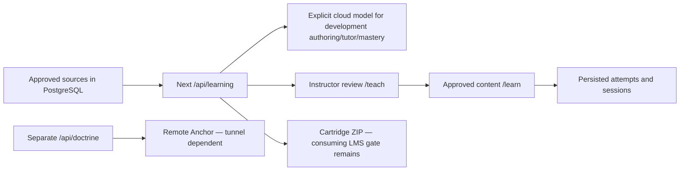

# Operation Cold Bore — Range Card

**Operator handoff proposed to Thompson · 2026-09-15 · Unclassified / releasable**

Thompson retains GitHub #9 QA/run-of-show ownership. This supports #14 without
reassigning issues. The [evidence matrix](EVIDENCE-MATRIX.md) is the authority for
dates, environments, classes, historical numbers and limits. No new live AI,
hardware, browser or LMS runs were performed for this documentation update.

## Pitch — evidence-safe version

SchoolCircle aims to connect source-grounded authoring, instructor review and
learner practice across five use cases: **#1 rubrics, #13 instructional design,
#16 MCPP, #12 tutoring and #9 mastery evaluation**.

On **2026-09-15**, the **development Next.js app**, using **live cloud API calls
and PostgreSQL**, completed a bounded loop on fictional training material:
draft and approve a course/rubric, answer with citations or refuse an unsupported
question, and reload persisted mastery turns. This was an API demonstration,
not the complete browser journey or an educational-efficacy study.

Earlier reports describe Anchor on offline hardware. We keep that evidence
separate from today's cloud-provider loop. Human review, browser sign-in, the
disconnected Next delivery loop and acceptance by a target LMS each need their
own evidence. Cite-or-refuse is a design goal, not a guarantee that AI cannot err.

## Current map — source-inspected 2026-09-15, not browser acceptance

| Surface | Entry point / contract | Evidence boundary |
|---|---|---|
| Landing / login | `/`, `/login` | Published custom-domain routing has not been verified by this task |
| Learning / teaching | `/learn`, `/teach` | Current Next learning surfaces; use separate verified roles, not a prototype role toggle |
| Legacy / planning board | `/prototype`, `/plan` | Retained routes, not substitutes for proving `/learn` and `/teach` |
| Source / authoring | `/api/learning/sources`, `/sources/pdf`, `/sources/:id/approve`; `/api/learning/courses/draft`, `/courses/:id/approve` | Authenticated instructor, approved sources, explicit model configuration; draft then review, not automatic ratification |
| Rubrics | `/api/learning/rubrics/generate`, `/rubrics/:id/approve` | Approved source and instructor/model gates |
| Course tutor | `/api/learning/tutor` | Approved persisted sources + model seam; not the direct Anchor widget |
| Remote doctrine | `/api/doctrine` → Anchor `/api/ask` | Separate service path; unavailable/tunnel failure is not proof of local FTS fallback |
| Mastery | `/api/learning/mastery/sessions`, `/sessions/:id/turn` | Persisted sessions/reports; completion is not necessarily mastery |
| Improve / plan | `/api/learning/analytics`, `/study-plan`, `/aar`, `/profile`, `/fidelity` | Prefix abbreviated after first route: all under `/api/learning`; `/api/plan` is the original planning board, not Cadence |
| Export | `/api/learning/export?courseId=<id>&version=1.2` (or `2004`) | Instructor + approved course; ZIP is not LMS acceptance |

Paths abbreviated within a row share that row's `/api/learning` prefix.
The old `/api/generate/course`, `/api/ask`, `/api/mastery/start` and
`/api/scorm/:courseId` diagrams are not operator instructions for this app.
The twelve pinned companion dependencies are catalogued in
[arsenal verification](../arsenal-verification.md); Anchor is HTTP, not a package
every companion necessarily calls. Understudy is an instructor evidence path,
not a guaranteed per-answer gate or a tutor fallback.



## Preflight — Replit development only

Use the existing **artifacts/schoolcircle: web** workflow; it starts the root
Next app with `pnpm -w run dev`. Do not start a second API or web server.
For a cold dependency setup, from the root:

```bash
pnpm install --frozen-lockfile
pnpm run db:generate       # Prisma client only; does not change the database
```

The root `pnpm run dev` command binds `0.0.0.0` at `$PORT` (default 3000).
Open the managed preview, then `/login`, `/teach` or `/learn`; do not hardcode
`:3111`. Use the current lockfile and installed Node toolchain. Do not use npm,
install unpinned GitHub packages, run Docker, reset/seed the database or migrate
PostgreSQL as part of rehearsal. Missing prerequisites go to the baseline owner.
Configuration belongs in secure workspace settings, never slides or this card.
A stored API key alone does not select/enable a provider.

1. Record the exact environment and revision, and load the latest proof reports.
2. Confirm the existing server and database are healthy. Availability at
   `/api/learning/status` is a configuration check, not a successful workflow.
3. Confirm actual instructor and learner sign-in and role restrictions in the
   intended browser. API test sessions do not satisfy this gate.
4. Open the approved, SME-reviewed banked course and citations; reload as a
   learner. Record which course is banked and when/reviewer it was approved.
   If it is not ready, do not call historical fixtures “reviewed golden content.”
5. If live generation is enabled, use only authorized non-sensitive material.
   Confirm failure is shown explicitly; never silently substitute generated data.
6. If showing Anchor, verify this session's response source and citation. A
   historical tunnel URL or health report does not establish today's availability.
7. Prepare an evidence-only version of every blocked beat. Do not claim a
   published update at `schoolcircle.tannerwhite.net` from workspace results.

### Edge rig — separate, gated environment

Historical instructions referenced `nps-hackathon/ops/tunnel.sh`,
`ops/orin-check.sh`, `ops/OFFLINE.md`, workstation Docker Postgres and a USB-linked
Orin. Those scripts are **not present in this checkout** and must not be run as
Replit setup. The hardware owner must supply the actual rig runbook, local
dependencies and network-isolation evidence. Do not disconnect the cloud preview
and describe its failure as an offline demonstration.

PostgreSQL → SQLite requires a separately designed and tested provider/schema,
migration, query and deployment conversion, including JSON/enum support,
concurrency and persistence behavior. Changing `DATABASE_URL` alone cannot make
this PostgreSQL Prisma client an offline SQLite application. No conversion is
authorized here.

## Proposed five-minute script

**Thompson chooses driver and second speaker; two people speak.** These timings
are allocations, not measured performance. Read a gate before doing its action.

| Time | Beat / say and do | Gate or evidence-only alternative |
|---|---|---|
| 0:00–0:40 | Problem and five-use-case objective; identify today's environment | Say “development API evidence” if browser acceptance is unavailable |
| 0:40–1:40 | Instructor opens `/teach`; show draft→review→approved content (#13/#16) | Prefer current reviewed banked course. Optional live generation must not delay the beat; historical MCPP content is labeled historical |
| 1:40–2:40 | Second speaker: supported tutor question, citation passage, then unsupported question (#12) | Use the current approved corpus and identify course tutor versus Anchor. Refusal depends on corpus, not a memorized Javelin question. Show HHEM only if actually returned on this path |
| 2:40–3:30 | Show source-linked rubric and approval (#1); discuss ambiguity review | Browser + SME evidence required for a live claim; otherwise show the dated API proof, not an invented vague-standard result |
| 3:30–4:20 | Learner `/learn`: practice, reload, show recorded progress (#9) | Verified sign-in and persistence required. Say “recorded practice,” not “proved learning gain”; do not promise strong answer→mastered |
| 4:20–5:00 | Second speaker: delivery boundaries and export | Show ZIP as packaging only. Network-pull beat only with current disconnected hardware proof; MarineNet claim only with target-LMS report. Otherwise name these gates explicitly |

## Contingencies — stop or switch honestly

| Failure | Operator action / required disclosure |
|---|---|
| Generation slow, error or provider unavailable | Stop waiting within the beat; show the reviewed banked course and label it pre-generated. Preserve the visible failure; no fabricated successful generation |
| Banked course absent, unreviewed or inaccessible | Use the dated report as evidence-only; block a live learner-content claim |
| Anchor tunnel lost | Show unavailable state and skip remote doctrine. A separately proven course-tutor path may be shown under its own label; never call it Anchor or assume FTS/HHEM fallback |
| Venue network/cloud unavailable | Cloud preview, auth, database and model may all depend on connectivity. Only switch to a separately verified local rig; otherwise use banked offline presentation evidence, not a claimed live offline app |
| Sign-in/role or database failure | Stop the affected live flow; no client role spoof, bypass, destructive reset or Docker fix in Replit. Notify the owning lane and use the report |
| Export/player fails | Retain the error; state packaging versus runtime status separately; do not claim MarineNet acceptance |
| Unverified claim challenged | Name environment/date/class and source in the matrix. If absent, say “not verified”; do not extrapolate latency, cost, safety, mastery or deployment readiness |

## Submission checklist — evidence required, not “ready” by default

- [ ] Thompson approves the final run-of-show and speaker handoffs.
- [ ] Attach revision, demo date and environment to every headline claim.
- [ ] Verify intended demo URL and both roles' browser sign-in. Current local
      changes and historical showcase links do not prove published behavior.
- [ ] Attach reviewed golden-course provenance, releasability and learner reload
      evidence. API approval in a test is not human SME review.
- [ ] Link bounded [live API proof](../learning-loop-proof.md), fixture/database
      counts and browser report separately; do not sum historical tests.
- [ ] Attach disconnected hardware report before an offline claim.
- [ ] Attach named consuming-player launch/score/completion/resume report before
      a runtime claim; attach separate target MarineNet evidence before acceptance.
- [ ] Confirm repository/revision/license inventory and architecture against the
      actual submission. No publishing or repository push performed here.
- [ ] List open gates for sign-in, hardware, LMS, planning/reporting, access-control
      and provider/fidelity scope. Do not advertise CAC/LTI grade passback as done.
- [ ] Keep historical timing, corpus, cost and refusal figures attributed exactly
      as in the matrix; no new measurements or generalized safety claims.

Reports from the existing golden-course, baseline, browser, offline, SCORM and
planning/reporting workstreams should update the corresponding beats through
Thompson. Until then, this is a proposed, evidence-gated script, not acceptance.